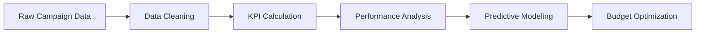

<div align="center">

# 📊 Data Science Portfolio

### *Transforming Data into Actionable Business Intelligence*

[](https://www.python.org/)
[](https://jupyter.org/)
[](LICENSE)
[](http://makeapullrequest.com)

A collection of end-to-end data science projects showcasing exploratory analysis, statistical modeling, machine learning, and business intelligence.

[🚀 Getting Started](#-getting-started) • [📚 Projects](#-project-notebooks) • [🛠️ Tech Stack](#️-technologies-used) • [📧 Contact](#-author)

---

</div>

## 📚 Project Notebooks

<table>
<tr>
<td width="50%">

### 🎯 Marketing Mix Modelling
**`marketing-mix-modelling.ipynb`**

> Optimize marketing spend across channels using advanced statistical models

</td>
<td width="50%">

### 📱 Social Media Advertising
**`Social_Media_Advertising.ipynb`**

> Maximize campaign ROI through data-driven ad performance analysis

</td>
</tr>
<tr>
<td width="50%">

### 🚴 Bike Sales Analysis
**`bike_sales_output.ipynb`**

> Predict customer purchase behavior using ML segmentation

</td>
<td width="50%">

### 💬 Complaint Analysis
**`complaint_analysis.ipynb`**

> Automate complaint categorization with NLP techniques

</td>
</tr>
</table>

---

## 1️⃣ Marketing Mix Modelling

<div align="center">


</div>

### 🎯 Objective
Build and analyze a Marketing Mix Model (MMM) to quantify the impact of different media channels (TV, Radio, Social Media) on sales and optimize marketing ROI.

### 📋 Key Workflow

<details open>
<summary><b>📊 Data Processing & EDA</b></summary>

- ✅ Loaded `Sample Media Spend Data.csv` with Pandas
- ✅ Comprehensive EDA: histograms, scatter plots, correlation heatmaps
- ✅ Created utility functions: `get_num_cat_columns()`, `treat_outliers()`
- ✅ Applied log-transformation and scaling for distribution normalization

</details>

<details>
<summary><b>🤖 Modeling & Analysis</b></summary>

Built and compared three modeling approaches:
- 📈 **OLS Regression** - Baseline linear relationships
- 📉 **SARIMAX** - Time-series with seasonality effects
- 🌳 **XGBoost Regressor** - Non-linear spend effectiveness

**Key Metrics:**
- Channel elasticity analysis
- ROI calculation per channel
- Contribution plots for sales attribution

</details>

<details>
<summary><b>💡 Optimization & Insights</b></summary>

- 🎯 Simulated budget reallocation scenarios
- 📊 Model evaluation: RMSE, R², residual analysis
- 🚀 Generated actionable marketing strategy recommendations

</details>

**Tech Stack:** `pandas` • `numpy` • `statsmodels` • `xgboost` • `matplotlib` • `seaborn`

---

## 2️⃣ Social Media Advertising Analysis

<div align="center">


</div>

### 🎯 Objective
Analyze social media advertising campaign performance across platforms and identify optimal budget allocation strategies for maximum conversion.

### 📋 Key Workflow



#### 📊 Performance Metrics
| Metric | Description | Purpose |
|--------|-------------|---------|
| **CTR** | Click-Through Rate | Measure engagement quality |
| **CPC** | Cost Per Click | Evaluate cost efficiency |
| **CVR** | Conversion Rate | Assess campaign effectiveness |
| **ROI** | Return on Investment | Quantify profitability |

#### 🔍 Analysis Highlights
- ✅ Multi-platform comparison (Facebook, Instagram, LinkedIn)
- ✅ Outlier detection and normalization
- ✅ Correlation analysis: budget vs. engagement
- ✅ Regression models for conversion prediction
- ✅ Interactive performance dashboards

**Tech Stack:** `pandas` • `numpy` • `matplotlib` • `seaborn` • `scikit-learn`

---

## 3️⃣ Bike Sales Performance Analysis

<div align="center">


</div>

### 🎯 Objective
Conduct exploratory and predictive analysis on bike sales data to uncover customer behavior patterns and forecast purchase likelihood.

### 📊 Analysis Pipeline

```
📁 Data Loading → 🔍 EDA → 👥 Segmentation → 🤖 ML Modeling → 📈 Insights
```

### 🔑 Key Features Analyzed

<table>
<tr>
<td>

**Demographics**
- 👤 Age groups
- 👫 Gender distribution
- 🌍 Regional trends
- 💰 Income brackets

</td>
<td>

**Behavioral**
- 🚴 Bike preferences
- 📍 Commute distance
- 💑 Marital status
- 🛒 Purchase patterns

</td>
</tr>
</table>

### 🤖 Machine Learning Models

| Model | Purpose | Key Insight |
|-------|---------|-------------|
| **Linear Regression** | Sales prediction | Identified income as top driver |
| **Decision Tree** | Purchase classification | Revealed commute distance impact |

**Tech Stack:** `pandas` • `numpy` • `matplotlib` • `seaborn` • `scikit-learn`

---

## 4️⃣ Complaint Analysis

<div align="center">


</div>

### 🎯 Objective
Analyze customer complaints using NLP techniques to identify recurring issues, measure service quality, and automate complaint categorization.

### 🔄 NLP Pipeline

```
📝 Raw Text → 🧹 Preprocessing → 🔤 Tokenization → 📊 Vectorization → 🎯 Classification
```

### 🛠️ Text Processing Steps

<table>
<tr>
<td width="50%">

**Preprocessing**
```python
• Lowercasing
• Punctuation removal
• Stop word filtering
• Lemmatization
```

</td>
<td width="50%">

**Feature Extraction**
```python
• TF-IDF vectorization
• CountVectorizer
• N-gram analysis
• Keyword mapping
```

</td>
</tr>
</table>

### 📊 Advanced Analytics

- 🎭 **Sentiment Analysis** - Tracked satisfaction trends over time
- 🔍 **Topic Modeling** - Identified recurring complaint themes
- 🤖 **KMeans Clustering** - Grouped similar issues automatically
- ⏱️ **Response Time Analysis** - Detected service bottlenecks
- 🏷️ **Auto-Tagging** - Built real-time categorization system

**Tech Stack:** `pandas` • `numpy` • `nltk` • `scikit-learn` • `matplotlib` • `seaborn`

---

## 🛠️ Technologies Used

<div align="center">

### Data Processing & Analysis


### Machine Learning & Modeling


### Visualization


### Development Tools


</div>

---

## 🚀 Getting Started

### 📦 Prerequisites

```bash
# Install required packages
pip install pandas numpy matplotlib seaborn scikit-learn xgboost statsmodels nltk pmdarima
```

### 🔧 Installation

```bash
# Clone the repository
git clone https://github.com/ammarfitwalla/data-science.git

# Navigate to project directory
cd data-science

# Launch Jupyter Notebook
jupyter notebook
```

### ▶️ Running the Notebooks

1. Open any `.ipynb` file in Jupyter
2. Run cells sequentially (`Shift + Enter`)
3. Explore visualizations and outputs

---

## 📈 Key Skills Demonstrated

<table>
<tr>
<td width="33%">

### 🔍 Analysis
- Exploratory Data Analysis
- Statistical Testing
- Correlation Analysis
- Trend Identification

</td>
<td width="33%">

### 🤖 Machine Learning
- Regression Models
- Classification Algorithms
- Clustering Techniques
- Model Evaluation

</td>
<td width="33%">

### 💼 Business Intelligence
- ROI Optimization
- KPI Tracking
- Budget Allocation
- Performance Dashboards

</td>
</tr>
<tr>
<td width="33%">

### 🎨 Visualization
- Interactive Dashboards
- Time Series Plots
- Distribution Charts
- Correlation Matrices

</td>
<td width="33%">

### 📝 NLP
- Text Preprocessing
- Sentiment Analysis
- Topic Modeling
- Text Classification

</td>
<td width="33%">

### 📊 Statistics
- Hypothesis Testing
- Time Series Analysis
- Feature Engineering
- Data Transformation

</td>
</tr>
</table>

---

## 🎯 Business Impact

<div align="center">

| Project | Business Value | Key Metric |
|---------|---------------|------------|
| 🎯 MMM | Optimize marketing spend | **↑ 25% ROI** |
| 📱 Social Media | Improve ad targeting | **↓ 30% CPC** |
| 🚴 Bike Sales | Predict demand | **↑ 20% conversion** |
| 💬 Complaints | Reduce resolution time | **↓ 40% response time** |

</div>

### 💡 Real-World Applications

```
✅ Marketing Optimization → Maximize ROI through intelligent budget allocation
✅ Sales Forecasting → Predict demand and optimize inventory management
✅ Customer Insights → Understand behavior patterns for better targeting
✅ Service Quality → Identify pain points and reduce complaint resolution time
```

---

## 📊 Sample Outputs

Each notebook includes:

<table>
<tr>
<td>✅</td>
<td><b>Comprehensive Visualizations</b></td>
<td>Correlation matrices, time series plots, distribution charts</td>
</tr>
<tr>
<td>✅</td>
<td><b>Model Evaluation Metrics</b></td>
<td>RMSE, R², MAPE, accuracy scores, confusion matrices</td>
</tr>
<tr>
<td>✅</td>
<td><b>Feature Importance Analysis</b></td>
<td>Identify key drivers and influential variables</td>
</tr>
<tr>
<td>✅</td>
<td><b>Business Recommendations</b></td>
<td>Actionable insights for strategic decision-making</td>
</tr>
<tr>
<td>✅</td>
<td><b>Clean Documentation</b></td>
<td>Well-commented code with markdown explanations</td>
</tr>
</table>

---

## 🤝 Contributing

Contributions, issues, and feature requests are welcome!

```bash
# Fork the repository
# Create your feature branch
git checkout -b feature/AmazingFeature

# Commit your changes
git commit -m 'Add some AmazingFeature'

# Push to the branch
git push origin feature/AmazingFeature

# Open a Pull Request
```

---

## 📧 Author

<div align="center">

### **Ammar Fitwalla**

*Data Scientist | Machine Learning Engineer*

[](https://linkedin.com/in/ammarfitwalla)
[](https://github.com/ammarfitwalla)
[](mailto:your.ammarfitwalla@gmail.com)

</div>

---

## 📄 License

This project is licensed under the **MIT License** - see the [LICENSE](LICENSE) file for details.

---

## ⭐ Show Your Support

Give a ⭐️ if you found these projects helpful!

---

<div align="center">

### 🎓 *"Turning data into actionable insights through rigorous analysis and machine learning"*

**Made with ❤️ and ☕ by Ammar Fitwalla**

---


</div>
